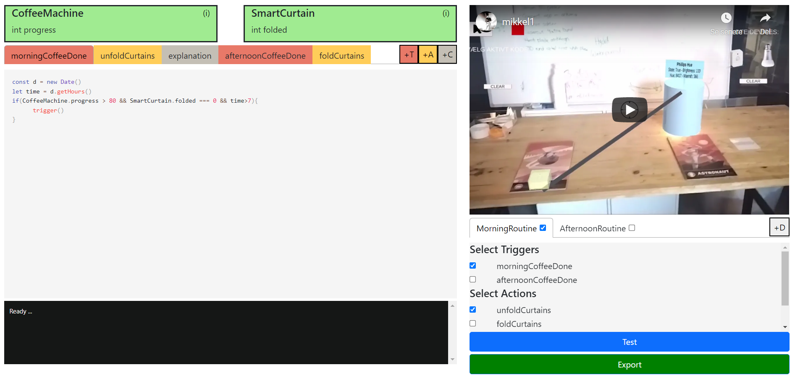
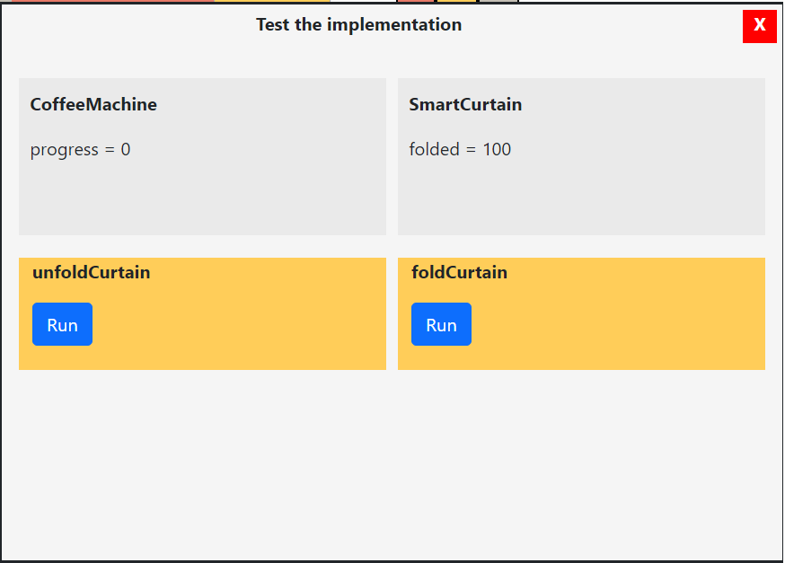

# Expert IDE
In this IDE you can implement features requested by novices.



## Device Panel
The device panel shows the devices the novice wants you to program, and their corresponding fields.
To get/set a value in the code, click the name of the field in the device panel.

## Video Panel
The video panel shows a video recorded by novices, explaining their request to you. Feel free to play through as many times you like.

## Export Panel
Select the actions, triggers and comments you want to export to the novice.

Press test to test the implementation.

Press export to send the implementation. Any errors in the code will show in the debug panel.

### Testing
Actions can be tested before sending them to the novice.
This feature is experimental, so it may not work.




## Editor

### Trigger
Triggers are conditions that causes actions to trigger. All triggers must eventually call trigger()

Example:
```
const d = new Date()
let time = d.getHours()
if(CoffeeMachine.progress > 80 &&  SmartCurtain.folded === 0 && time > 7){
  trigger()
}
```

To allow users to chose from multiple different triggers, add a new trigger.

### Action
Actions are called when trigger() is called. Can be used to set values of actuators.

Example:
```
SmartCurtain.folded = 100;
```

To allow users to chose from multiple different triggers, add a new trigger.

### Comment
Comments are your primary way to explain the feature to the novice.
Try to remember they might not have any technical experience at all.

Example:
```
I made your kitchen light turn bright when your coffee machine is done.
```

Multiple comments can be defined.


